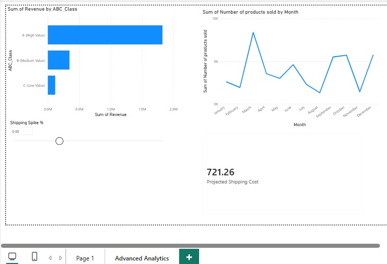

# 📦 Supply Chain Inventory Risk & Demand Analysis

## 📊 Project Overview
This project solves a critical supply chain problem: **preventing stockouts and overstocking.** Using a real-world dataset from a Fashion & Beauty startup, I built an end-to-end data pipeline to optimize inventory planning.

**Business Value Delivered:**
* **Reduced Risk:** Identified "Cash Trap" products (High Stock, Low Sales).
* **Improved Forecasting:** Deployed AI models to predict stockouts 3 months in advance.
* **Financial Modeling:** Built a dynamic stress-test tool for shipping costs.

## 🛠️ Tech Stack & Workflow
* **Python (Pandas):** Data cleaning, ABC Analysis (Pareto Principle), and Logic Engineering.
* **SQL (SQLite):** Categorized inventory risk using complex `CASE` statements.
* **Power BI:** Interactive Dashboard with DAX measures and AI Forecasting.

## 📈 Dashboard Features
The dashboard includes three advanced analytical layers:

### 1. ABC Analysis (Pareto Principle)
Segmented inventory into **Class A (High Value)**, B, and C.
* *Insight:* Top 20% of products generate 80% of revenue.

### 2. Financial "What-If" Modeling
Created a **Dynamic Slider** to simulate shipping cost spikes (0-100%) and instantly see the impact on profit margins.

### 3. AI Demand Forecasting
Used time-series forecasting to predict demand trends for the next quarter.

## 🧠 Key Insights
1.  **Inventory Health:** A significant portion of capital was tied up in slow-moving "Class C" inventory.
2.  **Revenue Drivers:** Skincare products drive the majority of revenue but face higher lead time risks.
3.  **Actionable Plan:** Recommended immediate liquidation of "Overstocked" items to free up cash flow for "Class A" restocking.
